# Concurrency with Go
## Understanding Concurrency Fundamentals

---

# What are Goroutines?

- **Lightweight threads** managed by Go runtime
- **2KB** initial stack vs **2MB** for OS threads
- Multiplexed onto OS threads by the scheduler
- Can have **thousands** running simultaneously

```go
// Simple goroutine
go func() {
    fmt.Println("Hello from goroutine!")
}()
```

---
layout: two-cols
---

# Sequential Execution

```go
func main() {
    processTask("Task 1")
    processTask("Task 2")
    processTask("Task 3")
}

func processTask(name string) {
    fmt.Printf("Processing %s\n", name)
    time.Sleep(1 * time.Second)
}
```

**Total time: 3 seconds**

::right::

# Concurrent Execution

```go
func main() {
    go processTask("Task 1")
    go processTask("Task 2")
    go processTask("Task 3")

    time.Sleep(2 * time.Second)
}

func processTask(name string) {
    fmt.Printf("Processing %s\n", name)
    time.Sleep(1 * time.Second)
}
```

**Total time: ~1 second**

---

# Execution Timeline Visualization


---

# The Problem: Goroutines vs Main

```go {1-6|7-12}
func main() {
    go fmt.Println("Goroutine 1")
    go fmt.Println("Goroutine 2")
    go fmt.Println("Goroutine 3")

    // main() exits immediately!
    // Goroutines might not run
}

func main() {
    go fmt.Println("Goroutine 1")
    go fmt.Println("Goroutine 2")
    go fmt.Println("Goroutine 3")

    time.Sleep(100 * time.Millisecond)
    // Better, but not ideal...
}
```

---

# Enter Channels 📡

> *"Don't communicate by sharing memory; share memory by communicating"*

```go
// Create a channel
ch := make(chan string)

// Send to channel (blocks until received)
ch <- "Hello"

// Receive from channel (blocks until sent)
message := <-ch
```

**Key concept**: Channels provide **synchronization** + **communication**

---

# Channels in Action

```go {1-3|5-10|12-16}
func main() {
    ch := make(chan string)

    // Start a goroutine
    go func() {
        time.Sleep(1 * time.Second)
        ch <- "Hello from goroutine!"
    }()

    // Wait for message (blocks here)
    message := <-ch
    fmt.Println("Received:", message)

    // No need for time.Sleep!
    // Channel handles synchronization
}
```

---

# Channel Communication Flow


---

# Real-World Pattern: Worker Pool

**Problem**: Process many tasks with controlled concurrency

```mermaid
graph LR
    Jobs[Jobs Channel<br/>📋] --> W1[Worker 1<br/>👷]
    Jobs --> W2[Worker 2<br/>👷]
    Jobs --> W3[Worker 3<br/>👷]
    W1 --> Results[Results Channel<br/>📊]
    W2 --> Results
    W3 --> Results
    Results --> Main["main()"<br/>📱]

    style Jobs fill:#e1f5fe
    style Results fill:#f3e5f5
    style W1,W2,W3 fill:#e8f5e8
```



---

# Worker Pool Implementation

```go {1-6|8-15|17-25|27-32}
func main() {
    jobs := make(chan int, 100)
    results := make(chan int, 100)

    // Start 3 workers
    for w := 1; w <= 3; w++ {
        go worker(w, jobs, results)
    }

    // Send 9 jobs
    for j := 1; j <= 9; j++ {
        jobs <- j
    }
    close(jobs)

    // Collect all results
    for a := 1; a <= 9; a++ {
        result := <-results
        fmt.Printf("Result: %d\n", result)
    }
}

func worker(id int, jobs <-chan int, results chan<- int) {
    for j := range jobs {
        fmt.Printf("Worker %d processing job %d\n", id, j)
        time.Sleep(time.Second) // Simulate work
        results <- j * j // Send result
    }
}
```

---

# Worker Pool Benefits

✅ **Controlled concurrency** - Only 3 workers, not 9 goroutines per job

✅ **Efficient resource usage** - Workers reused for multiple jobs

✅ **Backpressure handling** - Buffered channels prevent overwhelming

✅ **Clean shutdown** - `close(jobs)` signals workers to stop

✅ **Scalable** - Easy to adjust worker count

---

# Key Takeaways

## 🚀 **Goroutines**
- Lightweight concurrent execution
- Use `go` keyword to start

## 📡 **Channels**
- Safe communication between goroutines
- Provide synchronization automatically

## 🏭 **Worker Pool**
- Practical pattern for controlled concurrency
- Combines goroutines + channels effectively

---

# Next Steps

- **Practice**: Try the worker pool pattern in your projects
- **Learn more**: `select` statements, buffered channels
- **Explore**: Fan-in/fan-out, pipeline patterns
- **Debug**: Use `go run -race` to catch race conditions

## Questions? 🤔

---

# Bonus: Quick Demo

Let's see goroutines in action!

```go
func main() {
    for i := 1; i <= 5; i++ {
        go func(num int) {
            fmt.Printf("Goroutine %d starting\n", num)
            time.Sleep(time.Duration(rand.Intn(1000)) * time.Millisecond)
            fmt.Printf("Goroutine %d finished\n", num)
        }(i)
    }

    time.Sleep(2 * time.Second)
    fmt.Println("All done!")
}
```

*Try running this - notice the random order!*
