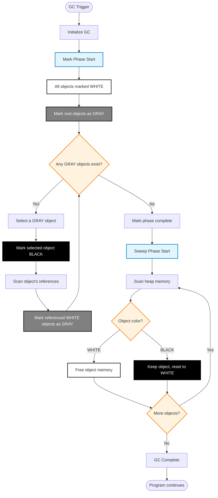

# Go Garbage Collection Workflow

## Object States in Go GC

- **WHITE**: Potentially unreachable objects (candidates for collection)
- **GRAY**: Objects discovered but not yet scanned for references  
- **BLACK**: Objects confirmed as reachable and fully scanned

## Phases

1. **Mark Phase**: Traverse object graph, marking reachable objects
2. **Sweep Phase**: Free memory of unmarked (WHITE) objects