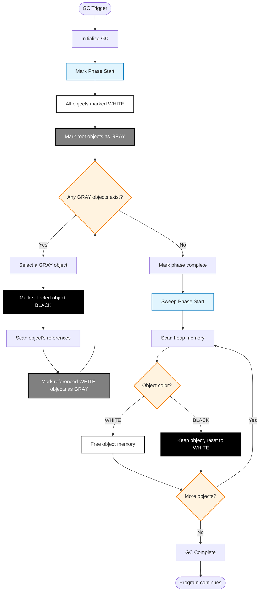

table of content

---

memory management in a program

C allocate and free memory

forgot free memory

some engineers free same memory twice and crush the program

---

is that engineer's work?

We should focus on business logic, design and other things

---

Garbage Collector

dynamically free memory

---

is that all happy?

-> No

During GC operation, the application stops

Stop the world (STW)

---

go gc basic

concurrent mark sweep

---

tri color

sweep

STW

---

# Go GC Workflow



---

# Object States in Go GC

- **WHITE**: Potentially unreachable objects (candidates for collection)
- **GRAY**: Objects discovered but not yet scanned for references
- **BLACK**: Objects confirmed as reachable and fully scanned

---

problem

many overhead


---

```go

type sample struct{}

func NewValue() sample {
	s := sample{}
	return s // <- stack
}

func NewPointer() *sample {
	s := sample{}
	return &s // <- heap
}


```
